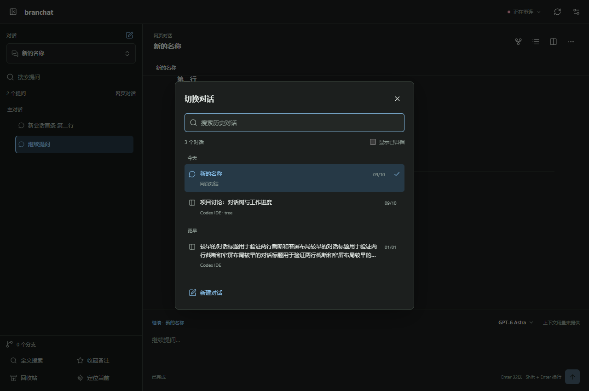

<p align="center">
  
</p>

<h1 align="center">branchat</h1>

<p align="center">A lightweight web interface for branching Codex conversations.</p>

<p align="center"></p>

## Requirements

- Windows 10/11
- Node.js 20+
- Codex CLI already installed and authenticated

## Install

```bash
git clone https://github.com/GzqHerry/branchat.git
cd branchat
npm ci --omit=dev --ignore-scripts
```

## Start

Double-click `Start.cmd`, then open:

```text
http://127.0.0.1:47831
```

For a manual start:

```bash
node server.mjs
```

Use `Restart.cmd` after updating the project. Use `Stop.cmd` to stop the service.

## Configuration

Set `TREE_CODEX_EXE`, `TREE_DATA_DIR`, `TREE_SOURCE_HOME`, `TREE_PYTHON`, or `PORT` before starting when the defaults do not match your machine.

SSH hosts can be added from the connection button in the top bar. Passwords are used only for the current connection and are never written to disk.

## License

Project code is provided for personal and internal use. Third-party notices are included in the repository.
